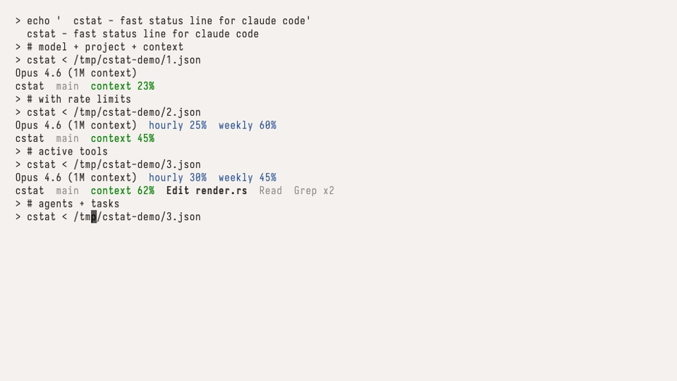

# cstat

[](https://crates.io/crates/cstat)
[](https://crates.io/crates/cstat)
[](LICENSE)

a fast, native status line for claude code. written in rust. single binary, zero runtime dependencies, sub-millisecond startup.

```
brew install basuev/cstat/cstat
```



## why cstat

|  | cstat | claude-hud |
|---|---|---|
| language | rust | bash + jq |
| execution time | **2ms** | **62ms** (33x slower) |
| subprocess spawns | 0 | 24 (jq, git, grep, date...) |
| binary size | 994K | 56K (but requires jq, git, coreutils) |
| runtime deps | none | bash, jq, git, ccusage |
| standalone mode | yes | no |
| rate limit reset timers | yes | no |
| incremental transcript parsing | yes (mmap) | no |
| platforms | macOS + Linux (arm64/x86) | macOS + Linux |

cstat is invoked by claude code every ~300ms. at that frequency, execution time matters: claude-hud spawns 24 subprocesses on each call, cstat spawns zero.

> benchmarked with [hyperfine](https://github.com/sharkdp/hyperfine) on Apple M3 Pro, 50 runs each.

## install

### homebrew (macOS)

```
brew install basuev/cstat/cstat
```

### from crates.io

```
cargo install cstat
```

### binary download

grab a binary from [releases](https://github.com/basuev/cstat/releases/latest):

```sh
curl -L -o cstat https://github.com/basuev/cstat/releases/latest/download/cstat-darwin-arm64
chmod +x cstat
mv cstat /usr/local/bin/
```

available binaries: `cstat-darwin-arm64`, `cstat-darwin-amd64`, `cstat-linux-amd64`, `cstat-linux-arm64`.

### from source

```
cargo install --git https://github.com/basuev/cstat
```

## usage

add to `~/.claude/settings.json`:

```json
{
  "statusLine": {
    "type": "command",
    "command": "cstat"
  }
}
```

claude code will invoke cstat as a subprocess, piping session data to stdin. the status line updates automatically every ~300ms.

### standalone

pipe claude code's json stream into cstat directly:

```sh
claude --output-format stream-json | cstat
```

### what it shows

line 1 (model + rate limits):
```
Opus 4.6 (1M context)  hourly 25% (1h30m reset)  weekly 60%
```

line 2 (project + context + activity):
```
my-project  main*  context 45%  Edit auth.ts  Grep x3  explore[haiku] 2m15s  tasks 3/7
```

includes: model name, rate limits with reset timer, project directory, git branch, context window usage, active tools, subagents, and task progress.

## configuration

create `~/.config/cstat/config.toml`:

```toml
[colors]
enabled = true

[format]
separator = " | "
```
